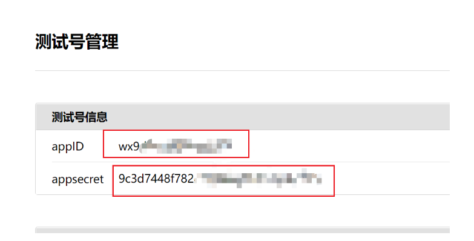
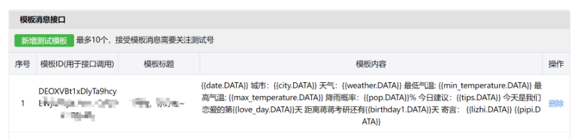
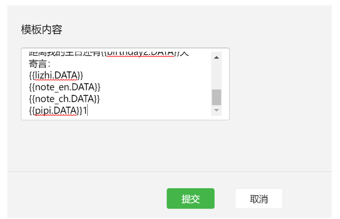
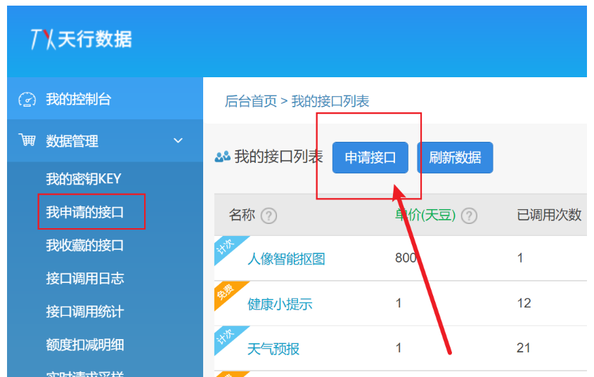
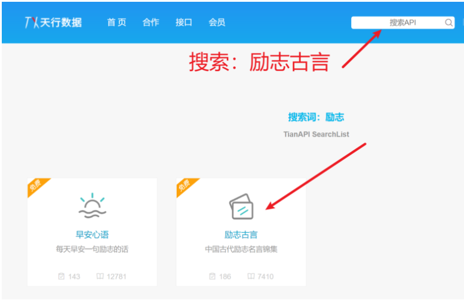
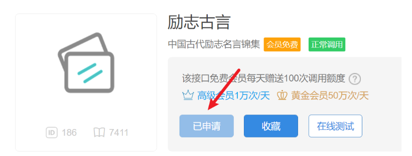
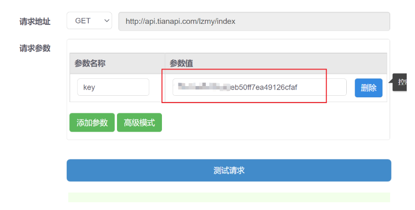
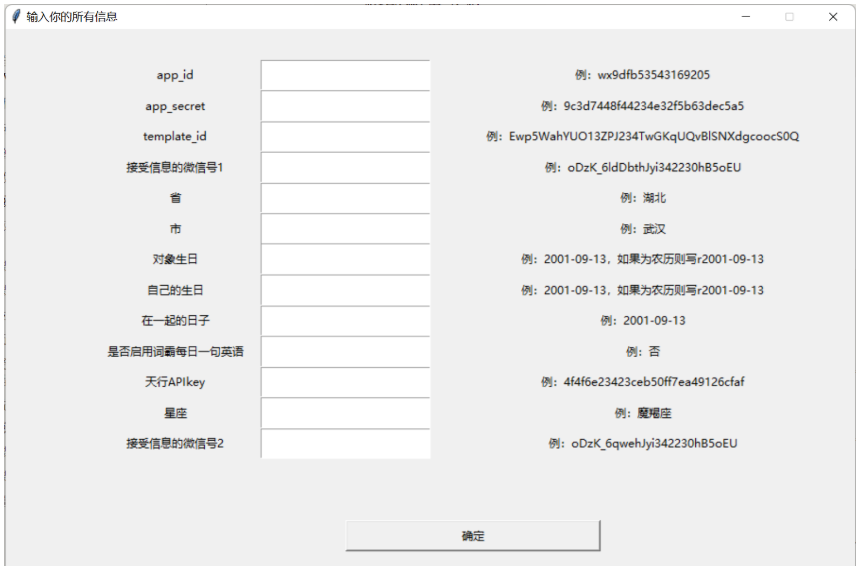
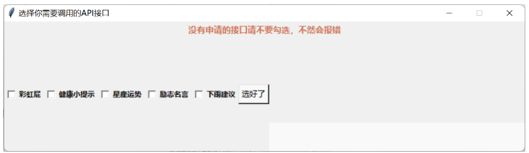

# 微信推送教程

## 1、前置条件

注册一个微信公众号，利用下面的链接注册一个微信公众测试号

`https://mp.weixin.qq.com/debug/cgi-bin/sandbox?t=sandbox/login` 

扫码登录成功后，就可以生成微信公众测试号的appID和appsecret这两串数字需要记住，后面会用到



扫描测试号二维码后会生成微信号，哪个账号需要接收推送信息就需要哪个账号扫码


## 2、新增测试模板

这里点击`新增测试模板



模板标题: 自定义，例如: 亲爱的，早上好!  



模板内容参考:  

**在config.txt里面记得要用到的日期数据名称与这里对应，比如你要用到第一个日期，就在config.txt中的birthday1里面填进去，如果你要用到第二个日期，就填上birthday2，同时在模板里面也要增加{{birthday2.DATA}}**

```
{{date.DATA}} 
城市：{{city.DATA}} 
天气：{{weather.DATA}} 
最低气温: {{min_temperature.DATA}} 
最高气温: {{max_temperature.DATA}}
降雨概率：{{pop.DATA}}%
今日建议：{{tips.DATA}}
今天是我们恋爱的第{{love_day.DATA}}天 
距离小宝生日还有{{birthday1.DATA}}天 
距离我的生日还有{{birthday2.DATA}}天 
寄言：
{{lizhi.DATA}} 
{{note_en.DATA}} 
{{note_ch.DATA}} 
{{pipi.DATA}}
```

这里面的每一个{{***.DATA}}都对应相应的数据，需要就保留，不需要就删掉，不想理解这些东西就直接放在这里不用删除也可以

不会用的同学可以直接复制上面这个模板，然后点击`提交`按钮

```
模板说明：
每个变量的含义如下所示，
{{date.DATA}}                  当天日期
{{city.DATA}}                  你所在的城市
{{weather.DATA}}               你所在城市的天气
{{min_temperature.DATA}}       你所在城市当天的最低气温
{{max_temperature.DATA}}       你所在城市当天的最高气温
{{pop.DATA}}                   你所在城市今天的降雨概率（需要API）
{{tips.DATA}}                  针对你所在城市的天气提出的建议（需要API）
{{love_day.DATA}}              你和对象在一起一共多少天了
{{birthday1.DATA}}             距离你对象的生日还有多少天
{{birthday2.DATA}}             距离你的生日还有多少天
{{lizhi.DATA}}                 随机出现一句励志古言（需要API）
{{note_en.DATA}}               词霸每日一句的英语
{{note_ch.DATA}}               词霸每日一句的中文
{{pipi.DATA}}                  一句彩虹屁（需要API）
可以自行添加的变量： 
{{health.DATA}}                一句健康小提示（需要API）
{{lucky.DATA}}                 今天的星座运势（需要API）
```

`注：没有申请API的同学不要慌，后面会教大家怎么申请`

## 3、对接api实现

这里我们使用天行API进行使用，下面以励志古言API进行举例，会了这一个，其他的都是一样的，可以实现更多功能。

> 打开天行API官网https://www.tianapi.com/，进行注册并且认证。



在控制台-数据管理-我申请的接口里面点击申请接口



搜索后选择励志古言，并且点击申请接口。

申请后如下图所示



这里你会得到你的key，页面不要关，这个key很重要，记下来



~~~
这里支持可以申请的api地址在下方，都只要申请后把key填进config.txt就可以了

励志古言API地址：https://www.tianapi.com/apiview/186

彩虹屁API地址：https://www.tianapi.com/apiview/181

天气预报API地址：https://www.tianapi.com/apiview/72

星座运势API地址：https://www.tianapi.com/apiview/78

健康小提示API地址：https://www.tianapi.com/apiview/122

都是填入之后，确保消息模板里面有对应的{{***.DATA}}
~~~

## 4、修改配置文件

打开write.exe



在里面填入你的所有信息，右边有相应的参考格式，不要直接复制右边的，然后点击`确定`



**勾选你想用的天行API，没有申请的不要勾选！！只勾选你申请了的！！**

## 5、直接运行main.exe就可以了！

## 6、最后别忘了留个小星星哦